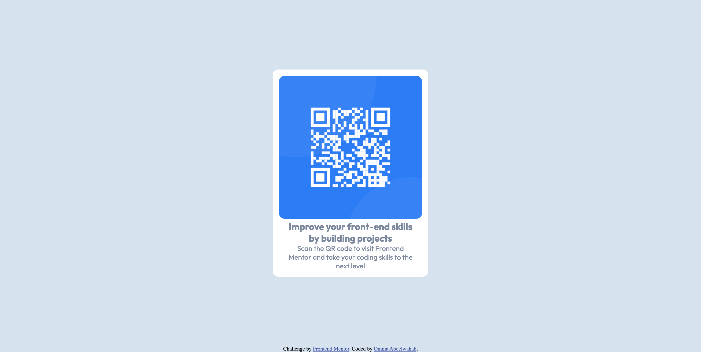

# Frontend Mentor - QR code component solution

This is a solution to the [QR code component challenge on Frontend Mentor](https://www.frontendmentor.io/challenges/qr-code-component-iux_sIO_H). Frontend Mentor challenges help you improve your coding skills by building realistic projects. 

## Table of contents

- [Overview](#overview)
  - [Screenshot](#screenshot)
  - [Links](#links)
- [My process](#my-process)
  - [Built with](#built-with)
- [Author](#author)

## Overview

### Screenshot

### Links

- Solution URL: [Solution URL](https://www.frontendmentor.io/solutions/qrcode-1lnTUm8RKN)
- Live Site URL: [Live site URL](https://onna4.github.io/Qr-code/)

## My process

### Built with

- Semantic HTML5 markup
- CSS custom properties
- Mobile-first workflow

## Author

- Linkedin - [Omnia Abdelwahab](https://www.linkedin.com/in/omnia-abdelwahab-170306249)
- Frontend Mentor - [@onna4](https://www.frontendmentor.io/profile/onna4)
